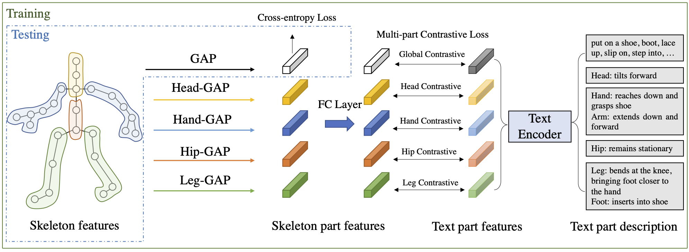

# LST
This repo is the official implementation for ["LST: Language Supervised Training for Skeleton-based Action Recognition"](https://arxiv.org/abs/2208.05318)

## Introduction

Skeleton-based action recognition has drawn a lot of attention for its computation efficiency and robustness to lighting conditions. Existing skeleton-based action recognition methods are typically formulated as a one-hot classification task without fully utilizing the semantic relations between actions. For example, "make victory sign" and "thumb up" are two actions of hand gestures, whose major difference lies in the movement of hands. This information is agnostic from the categorical one-hot encoding of action classes but could be unveiled in the language description of actions. Therefore, utilizing action language descriptions in training could potentially benefit representation learning. In this work, we propose a Language Supervised Training (LST) approach for skeleton-based action recognition. More specifically, we employ a large-scale language model as the knowledge engine to provide text descriptions for body parts movements of actions, and propose a multi-modal training scheme by utilizing the text encoder to generate feature vectors for different body parts and supervise the skeleton encoder for action representation learning. Experiments show that our proposed LST method achieves noticeable improvements over various baseline models without extra computation cost at inference. LST achieves new state-of-the-arts on popular skeleton-based action recognition benchmarks, including NTU RGB+D, NTU RGB+D 120 and NW-UCLA.

## Architecture of LST



# Prerequisites

- Python >= 3.6
- PyTorch >= 1.1.0
- PyYAML, tqdm, tensorboardX
- 

- We provide the dependency file of our experimental environment, you can install all dependencies by creating a new anaconda virtual environment and running `pip install -r requirements.txt `
- Run `pip install -e torchlight` 

# Data Preparation

Please follow [CTR-GCN](https://github.com/Uason-Chen/CTR-GCN) for data preparation

### Download datasets.

#### There are 3 datasets to download:

- NTU RGB+D 60 Skeleton
- NTU RGB+D 120 Skeleton
- NW-UCLA

#### NTU RGB+D 60 and 120

1. Request dataset here: https://rose1.ntu.edu.sg/dataset/actionRecognition
2. Download the skeleton-only datasets:
   1. `nturgbd_skeletons_s001_to_s017.zip` (NTU RGB+D 60)
   2. `nturgbd_skeletons_s018_to_s032.zip` (NTU RGB+D 120)
   3. Extract above files to `./data/nturgbd_raw`

#### NW-UCLA

1. Download dataset from [here](https://www.dropbox.com/s/10pcm4pksjy6mkq/all_sqe.zip?dl=0)
2. Move `all_sqe` to `./data/NW-UCLA`

### Data Processing

#### Directory Structure

Put downloaded data into the following directory structure:

```
- data/
  - NW-UCLA/
    - all_sqe
      ... # raw data of NW-UCLA
  - ntu/
  - ntu120/
  - nturgbd_raw/
    - nturgb+d_skeletons/     # from `nturgbd_skeletons_s001_to_s017.zip`
      ...
    - nturgb+d_skeletons120/  # from `nturgbd_skeletons_s018_to_s032.zip`
      ...
```

#### Generating Data

- Generate NTU RGB+D 60 or NTU RGB+D 120 dataset:

```
 cd ./data/ntu # or cd ./data/ntu120
 # Get skeleton of each performer
 python get_raw_skes_data.py
 # Remove the bad skeleton 
 python get_raw_denoised_data.py
 # Transform the skeleton to the center of the first frame
 python seq_transformation.py
```


# Training & Testing

### Training

- To train model on NTU60/120

```
# Example: training LST on NTU RGB+D cross subject joint modality
CUDA_VISIBLE_DEVICES=0,1 python main_multipart_ntu.py --config config/nturgbd-cross-subject/lst_joint.yaml --model model.ctrgcn.Model_lst_4part --work-dir work_dir/ntu60/csub/lst_joint --device 0 1
# Example: training LST on NTU RGB+D cross subject bone modality
CUDA_VISIBLE_DEVICES=0,1 python main_multipart_ntu.py --config config/nturgbd-cross-subject/lst_bone.yaml --model model.ctrgcn.Model_lst_4part_bone --work-dir work_dir/ntu60/csub/lst_bone --device 0 1
# Example: training LST on NTU RGB+D 120 cross subject joint modality
CUDA_VISIBLE_DEVICES=0,1 python main_multipart_ntu.py --config config/nturgbd120-cross-subject/lst_joint.yaml --model model.ctrgcn.Model_lst_4part --work-dir work_dir/ntu120/csub/lst_joint --device 0 1
# Example: training LST on NTU RGB+D 120 cross subject bone modality
CUDA_VISIBLE_DEVICES=0,1 python main_multipart_ntu.py --config config/nturgbd120-cross-subject/lst_bone.yaml --model model.ctrgcn.Model_lst_4part_bone --work-dir work_dir/ntu120/csub/lst_bone --device 0 1
```


- To train model on NW-UCLA

```
CUDA_VISIBLE_DEVICES=0,1 python main_multipart_ucla.py --config config/ucla/lst_joint.yaml --model model.ctrgcn.Model_lst_4part_ucla --work-dir work_dir/ucla/lst_joint --device 0 1
```


### Testing

- To test the trained models saved in <work_dir>, run the following command:

```
python main_multipart_ntu.py --config <work_dir>/config.yaml --work-dir <work_dir> --phase test --save-score True --weights <work_dir>/xxx.pt --device 0
```

- To ensemble the results of different modalities, run 
```
# Example: ensemble four modalities of LST on NTU RGB+D 120 cross subject
python ensemble.py --datasets ntu120/xsub --joint-dir work_dir/ntu120/csub/lst_joint --bone-dir work_dir/ntu120/csub/lst_bone --joint-motion-dir work_dir/ntu120/csub/lst_joint_vel --bone-motion-dir work_dir/ntu120/csub/lst_bone_vel
```

## Acknowledgements

This repo is based on [CTR-GCN](https://github.com/Uason-Chen/CTR-GCN). The data processing is borrowed from [SGN](https://github.com/microsoft/SGN) and [HCN](https://github.com/huguyuehuhu/HCN-pytorch). The code for different modality is adopted from [InfoGCN](https://github.com/stnoah1/infogcn). The implementation for contrastive loss is adopted from [ActionCLIP](https://github.com/sallymmx/ActionCLIP).

Thanks to the original authors for their work!

# Citation

Please cite this work if you find it useful:.
      @article{xiang2022lst,
        title={Language Supervised Training for Skeleton-based Action Recognition},
        author={Wangmeng Xiang, Chao Li, Yuxuan Zhou, Biao Wang, Lei Zhang},
        journal={arXiv preprint arXiv:2208.05318},
        year={2022}
      }